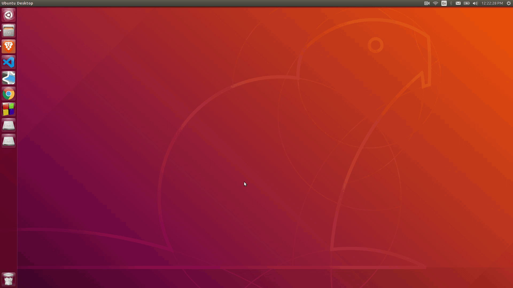

# GOT-terminal-greeter
a notable quote from Game of Thrones waits for you on opening the terminal



# Setup
Install curl and json processor
```
sudo apt install curl
sudo apt install jq
```

Locate the `.bashrc` file and append the following line
```
curl -s https://game-of-thrones-quotes.herokuapp.com/v1/random | jq -r '"\"" + .sentence + "\" - " + .character.name'
```

# Credits
[game-of-thrones-quotes-api](https://github.com/shevabam/game-of-thrones-quotes-api)
